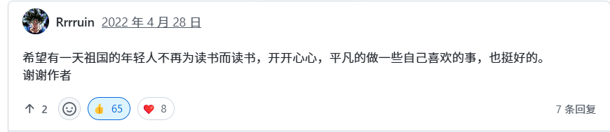

<h1 style="
    font-size: 2.2em; 
    text-align: center; 
    letter-spacing: 1px; 
    margin-top: 1.2em; 
    color: var(--md-default-fg-color); /* 使用主题文字颜色变量 */
    font-family: 'FZWeiBei-S03S', 'FangSong', 'KaiTi', '楷体', serif; /* 简化字体 */
">
    <b>问答之书：探索比答案更重要的思考</b>
</h1>

- [目录](index.md)
- [前言](前言.md)
- [选择的方式](测试说明.md)

??? info "个人成长内容"
    - 人际关系
        - [前言](个人成长内容/人际关系/index.md)
        - 交友相处篇 (待补充)
        - 团队合作篇 (待补充)
        - 送礼请客篇 (待补充)
        - 亲密关系篇 (待补充)
        - 异性相处篇 (待补充)
    - 可以掌握的技能
        - [前言](个人成长内容/可以掌握的技能/index.md)
        - [通识性技能](个人成长内容/可以掌握的技能/通识性技能.md)
        - [一些科学小知识](个人成长内容/可以掌握的技能/一些科学小知识.md)
        - 奇技淫巧
        
            * [前言](个人成长内容/可以掌握的技能/奇技淫巧/index.md)
            * [漏洞](个人成长内容/可以掌握的技能/奇技淫巧/部分漏洞.md)
            * [信息差](个人成长内容/可以掌握的技能/奇技淫巧/信息差.md)

??? info "文娱生活"
    - [前言](文娱生活/index.md)
    - [游玩指南](文娱生活/游玩指南.md)
    - [影视书籍推荐](文娱生活/影视书籍推荐.md)
    - [看病就医](文娱生活/看病就医篇.md)
    - 衣食住行
        - [前言](文娱生活/衣食住行篇/index.md)
        - [穿搭指南](文娱生活/衣食住行篇/穿搭指南.md)

??? info "竞赛、论文、活动"
    - [前言](竞赛、论文、活动/index.md)

??? info "经验贴"
    - [前言](经验贴/收集说明.md)
    - 学长学姐说
        - 2019年入学
            - [空白文档](经验贴/学长学姐说/2019年入学/空白文档.md)
        - 2020年入学
            - [一份未写完的word文档](经验贴/学长学姐说/2020年入学/乱言.md)
            - [你可以成为任何你想成为的大人](经验贴/学长学姐说/2020年入学/做你想做.md)
            - [歪歪的碎碎念念](经验贴/学长学姐说/2020年入学/歪歪的碎碎念念.md)
        - 2021年入学
            - [空白文档](经验贴/学长学姐说/2021年入学/空白文档.md)
        - 2022年入学
            - [空白文档](经验贴/学长学姐说/2022年入学/空白文档.md)

??? info "轶事"
      - [前言](轶事/index.md)

??? info "后记"
    - [后记](后记.md)

---

-   ### :material-brain: 批判性思维
    
    !!! abstract "核心价值"
        深入剖析编程原则、架构选择、以及工程伦理背后的“为什么”。
        
-   ### :material-robot-excited: 超越工具
    
    !!! note "思维进阶"
        抛开具体语言或框架的语法细节，掌握软件构建的底层哲学和通用原则。
        
-   ### :material-leaf: 长期主义
    
    !!! info "人生规划"
        收集职业发展、知识积累中的反思性问题，帮助你规划长远的学习路径。
        
-   ### :material-flask: 科研方法论
    
    !!! question "科研之道"
        聚焦实验设计、数据解读、以及在交叉学科中如何快速学习和定位问题。

---

准备好挑战你的思维了吗？

<a href="前言/" class="md-button md-button--primary" style="margin: 0 auto; display: inline-block;">
    开始你的问答之旅
</a>

---
## 一位网友说的话

下面是我在 csdiy 评论区看到的一段话，说得很有道理。

---

暂时联系方式
QQ群: 1062748231